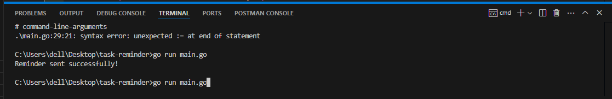
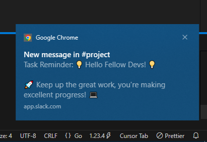
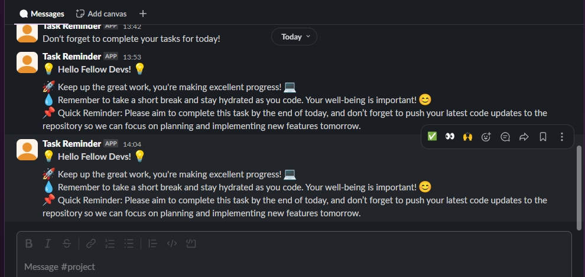

# Prodctivity Bot

A Micro-SaaS App to Keep Developers and Teams Motivated and On Track"

## Features
- Sends motivational messages to developers and team members, keeping them productive and focused throughout the day.
- Reminds the team about their daily goals to ensure progress and success.
- Easy to configure with environment variables, making it user-friendly and hassle-free.

## Problem Statement
- Developers often get distracted by other tasks or lose focus on their current project.
- Lack of motivation or reminders can lead to procrastination and decreased productivity.
- Difficulty in maintaining a consistent schedule for tasks and updates.

## Solution
- This app will send motivational messages to developers and team members, keeping them productive and focused throughout the day.
- It will remind the team about their daily goals to ensure progress and success.
- It will be easy to configure with environment variables, making it user-friendly and hassle-free.

## Motivation for the project
- Often, people struggle to stay focused and stick to their daily goals. They tend to get caught up thinking about long-term outcomes and procrastinate, forgetting the small, daily tasks that are crucial to reaching their big goals.
- This simple application serves as a small but powerful tool for company managers or owners. It allows them to send motivating messages to employees, helping them stay motivated, happy, and on track. It’s a gentle reminder not only to stay productive but also to prioritize their well-being and health, ensuring they remain focused and energized throughout the day.

## Prerequisites
- Go programming language installed ([Download Go](https://golang.org/dl/)).
- A Slack workspace and bot token ([Get Slack API Token](https://api.slack.com/apps)).

## Setup Instructions
1. Clone the repository or create a directory:
   ```bash
   mkdir task-reminder && cd task-reminder

## Screenshots





